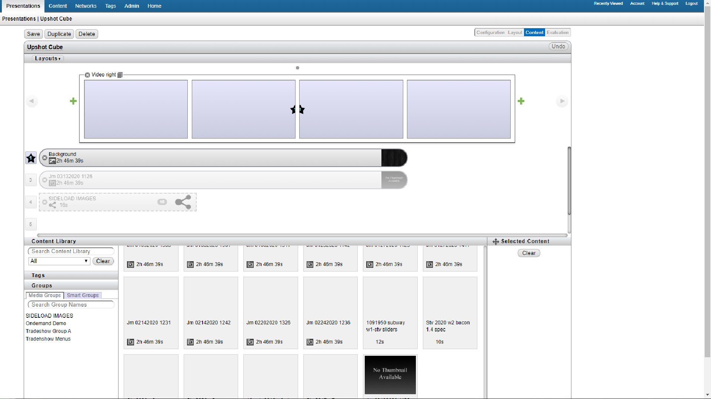

 

# RDM

Director is the interface for updating which build is displayed on the boards for testing purposes. This build does not go live until RDM recieves and implements the build.

 

## Setting the display

After pushing a build and logging into director, go to the "Presentations" tab and click on "Upshot Cube".

From there, go to the "Content Library" area, click the "Media Type" menu, and select "All". All previous build should show up. Scroll down to the bottom and find the newest build. It should match
the name of the build you just pushed.

In the "Layouts" panel, click on the number 3, then drag your new build to the left of the old build, which should look like a long rounded rectangle. Delete the old build from the layout
by clicking on the x and click "Save" in the upper left corner. Your new build should show up on the boards in a few minutes.
 

## Testing the build

In the "Networks" tab, select JM Cube. From here, click "Go to Location" at the top of the window. click the "Actions" button in the upper right and select "Edit data".
This will bring up a window where you can set various options for the build, like prices and what promotions are being displayed. click "Publish changes" and wait
for the boards to update. Make sure that everything displays correctly.
 

