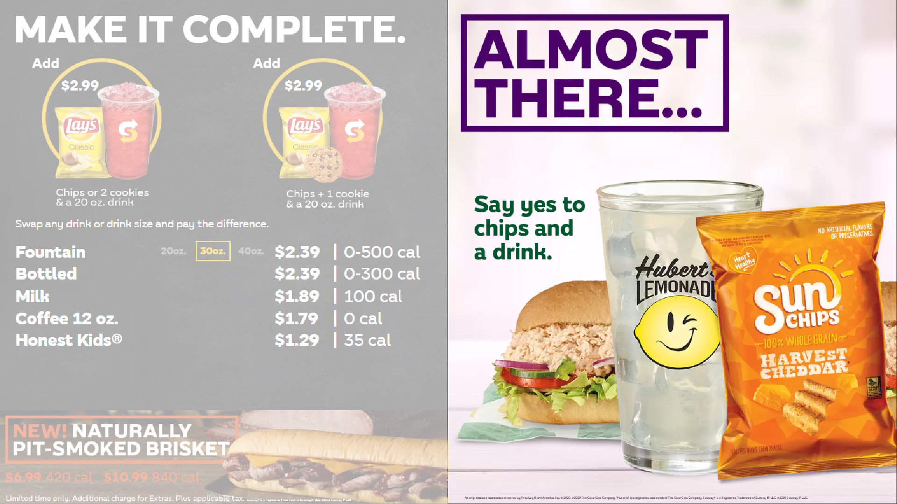

<br />

# Screen 4: Promo Panel

This area can be used to showcase up to three animated (or static) promotions at a time.
<br />



## Creating a new component

#### Path for new components:
```
src/components/Screens/ScreenFour/components
```

If one does not already exist, create a new folder and name it with the year and window number (ex. 2020w2). Within this folder is where you will 
create all the new promotions for that window. Each promotion should be contained within its own folder and within that folder should be folders called "dual" and "quad"
for the respective js and css files for both dual and quad screen store setups. There should also be a folder for images that can be shared between the two configurations.

It is also important that you copy the "index.js" file from the root of another screen one component and paste it in the root of your new component's folder. This will ensure that
the component can swap between quad and dual screen setups.

In order for them to appear, new promos need to be added to the playlist lineup in
```
src/components/Screens/ScreenFour/playlists/secondaryPromotions.js
```
by importing them at the top of the file, then adding the new component to the "components" object.

<br />

## Animation

Animation is done using gsap. Make sure to include gsap at the top of your file. Documentation for gsap can be found [here](https://greensock.com/docs/).

```
import 'gsap'
import 'gsap-then'
```
For more details on how to set up your component for animation, see [here](/animation-tips).

Note: Due to performace issues, it is important that when animating components for a dual screen setup, the only value that should be animated is the opacity of each image, via gsap's `autoAlpha` command.

<br />

## Key

```
value_menu_content
value_menu_content
```

Go to
```
src/neocast/local-data.js
```
and set this key to the value provided by the project manager in order to see the corresponding promotion appear on the boards.

<br />

## Kids Meal

The kids meal promotion can be turned on and off in this area using this key:
```
meal_deal_show_kids_meal
```

The promotion can be set using this key:
```
kids_meal_promo
kids_meal_price
```

## Setting price or other variable data

See [setting data](/setting-data)

