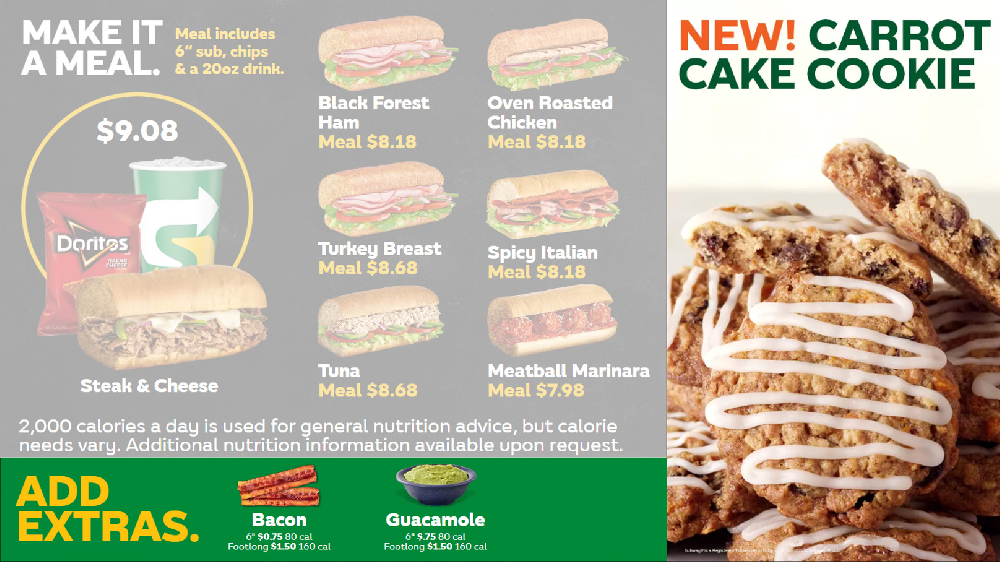

<br />

# Screen 2: Big Footer

This area is used to showcase add ons for sandwiches, such as cheese, bacon or guacamole.

<br />



## Keys

```
extras_bacon_price_6in
extras_bacon_price_12in

deluxe_addon_price_6in
deluxe_addon_price_12in

extras_double_meat_price_6in
extras_double_meat_price_12in

extras_cheese_price_6in
extras_cheese_price_12in

sides_chips_price
sides_cookies_price_1ct
sides_apples_price

gluten_free_bread
gluten_free_bread_price

extras_pepperoni_price_6in
extras_pepperoni_price_12in

extras_guacamole_price_6in
extras_guacamole_price_12in

extras_mozzarella_price_6in
extras_mozzarella_price_12in

extras_avocado_price_6in
extras_avocado_price_12in

sides_local_option_one
sides_local_option_two
```


## Setting price or other variable data

See [setting Data](/setting-data)
